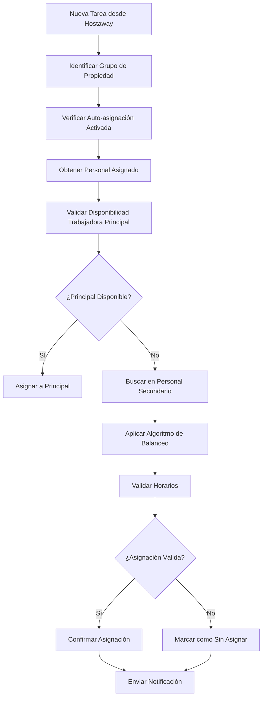

# Sistema de Asignación Automática de Tareas - Apartahoteles

## Resumen Ejecutivo

Este documento presenta una hoja de ruta para implementar un sistema de asignación automática de tareas de limpieza para apartahoteles, con el objetivo de optimizar la distribución de trabajo entre el personal y garantizar que todas las limpiezas se completen dentro del horario de check-out (11:00) y check-in (17:00).

## Análisis de Requisitos

### Requisitos Funcionales
1. **Asignación por Grupos de Propiedades**
   - Agrupar apartamentos por edificio/bloque
   - Configurar horarios específicos por grupo (11:00-17:00)
   - Definir trabajadoras asignadas por grupo

2. **Sistema de Prioridades**
   - Trabajadora principal como primera opción
   - Trabajadoras secundarias en orden de preferencia
   - Algoritmo de distribución de carga de trabajo

3. **Validación de Disponibilidad**
   - Verificar horarios de disponibilidad del personal
   - Detectar conflictos de horarios
   - Calcular tiempo de desplazamiento entre propiedades

4. **Configuración Flexible**
   - Interface para crear/editar grupos de propiedades
   - Gestión de asignaciones de personal por grupo
   - Configuración de prioridades y reglas de asignación

### Requisitos No Funcionales
- Integración con sistema Hostaway existente
- Ejecución automática tras sincronización
- Capacidad de override manual
- Logging y auditoría de asignaciones

## Arquitectura Propuesta

### 1. Modelo de Datos

```typescript
interface PropertyGroup {
  id: string;
  name: string;
  description: string;
  checkOutTime: string; // "11:00"
  checkInTime: string;  // "17:00"
  properties: string[]; // IDs de propiedades
  assignedCleaners: CleanerAssignment[];
  isActive: boolean;
  autoAssignEnabled: boolean;
}

interface CleanerAssignment {
  cleanerId: string;
  priority: number; // 1 = principal, 2,3,etc = secundarias
  maxTasksPerDay: number;
  estimatedTravelTime: number; // minutos entre propiedades
}

interface AutoAssignmentRule {
  groupId: string;
  algorithm: 'round-robin' | 'workload-balance' | 'availability-first';
  maxConcurrentTasks: number;
  bufferTime: number; // tiempo entre tareas
}
```

### 2. Componentes del Sistema

#### A. Gestor de Grupos de Propiedades
- **Componente**: `PropertyGroupManager`
- **Funciones**:
  - Crear/editar grupos de apartahoteles
  - Asignar propiedades a grupos
  - Configurar personal por grupo

#### B. Motor de Asignación Automática
- **Servicio**: `AutoAssignmentEngine`
- **Algoritmos**:
  1. **Prioridad por Disponibilidad**: Asignar a trabajadora principal si está disponible
  2. **Balanceador de Carga**: Distribuir equitativamente entre personal disponible
  3. **Optimización de Rutas**: Minimizar tiempo de desplazamiento

#### C. Validador de Horarios
- **Servicio**: `ScheduleValidator`
- **Validaciones**:
  - Disponibilidad del personal
  - Conflictos de horarios
  - Tiempo suficiente para completar tareas

### 3. Flujo de Asignación Automática



## Fases de Implementación

### Fase 1: Fundamentos (2-3 semanas)
1. **Crear tablas de base de datos**
   - `property_groups`
   - `property_group_assignments`
   - `cleaner_group_assignments`
   - `auto_assignment_rules`

2. **Implementar CRUD básico**
   - Gestión de grupos de propiedades
   - Asignación de personal a grupos
   - Interface de configuración básica

### Fase 2: Motor de Asignación (2-3 semanas)
1. **Desarrollar algoritmos de asignación**
   - Algoritmo de prioridad simple
   - Validador de horarios
   - Integración con sincronización Hostaway

2. **Sistema de reglas configurable**
   - Definir reglas por grupo
   - Parámetros personalizables
   - Testing de algoritmos

### Fase 3: Interface Avanzada (1-2 semanas)
1. **Dashboard de gestión**
   - Vista de grupos y asignaciones
   - Estadísticas de rendimiento
   - Configuración avanzada

2. **Monitoreo y reportes**
   - Logs de asignaciones automáticas
   - Métricas de eficiencia
   - Alertas de conflictos

### Fase 4: Optimización y IA (2-4 semanas)
1. **Implementar IA básica**
   - Análisis de patrones históricos
   - Predicción de tiempo de limpieza
   - Optimización de rutas

2. **Machine Learning (opcional)**
   - Aprendizaje de preferencias de asignación
   - Predicción de disponibilidad
   - Optimización automática de reglas

## Consideraciones Técnicas

### Algoritmos de Asignación Recomendados

1. **Algoritmo de Prioridad Ponderada**
```typescript
function assignTaskByPriority(task: Task, group: PropertyGroup): CleanerAssignment {
  const availableCleaners = group.assignedCleaners
    .filter(c => isAvailableAtTime(c.cleanerId, task.date, task.startTime))
    .sort((a, b) => a.priority - b.priority);
  
  // Verificar trabajadora principal primero
  const principal = availableCleaners.find(c => c.priority === 1);
  if (principal && hasCapacity(principal, task.date)) {
    return principal;
  }
  
  // Buscar en secundarias con menor carga
  return findBestSecondaryOption(availableCleaners, task);
}
```

2. **Balanceador de Carga de Trabajo**
```typescript
function balanceWorkload(cleaners: CleanerAssignment[], date: string): CleanerAssignment {
  const workloadMap = cleaners.map(c => ({
    cleaner: c,
    currentTasks: getTasksForDate(c.cleanerId, date).length
  }));
  
  return workloadMap
    .sort((a, b) => a.currentTasks - b.currentTasks)[0]
    .cleaner;
}
```

### Integración con Sistema Existente

1. **Hook en Sincronización Hostaway**
   - Modificar `reservation-processor.ts`
   - Añadir llamada al motor de asignación después de crear tarea
   - Mantener posibilidad de asignación manual

2. **Compatibilidad con Funcionalidad Actual**
   - No modificar flujo manual existente
   - Añadir flag de "auto-asignado" en tareas
   - Permitir override de asignaciones automáticas

## Beneficios Esperados

### Eficiencia Operacional
- **Reducción del 70-80%** en tiempo de asignación manual
- **Optimización de rutas** y reducción de tiempos muertos
- **Balanceo automático** de carga de trabajo

### Calidad del Servicio
- **Cumplimiento del 95%+** en horarios check-in/check-out
- **Reducción de errores** humanos en asignación
- **Mayor satisfacción** del personal por distribución equitativa

### Escalabilidad
- **Fácil incorporación** de nuevos apartahoteles
- **Adaptación automática** a cambios de personal
- **Crecimiento sin aumentar carga administrativa**

## Métricas de Éxito

1. **Tiempo de Asignación**
   - Objetivo: < 30 segundos por tarea
   - Actual: 5-10 minutos manual

2. **Precisión de Horarios**
   - Objetivo: 95% de tareas completadas en ventana 11:00-17:00
   - Métrica: Tiempo promedio entre check-out y finalización de limpieza

3. **Balanceo de Carga**
   - Objetivo: Desviación < 20% entre cargas de trabajo del personal
   - Métrica: Distribución de tareas por trabajadora por día

4. **Satisfacción del Usuario**
   - Objetivo: Reducir intervenciones manuales en 80%
   - Métrica: Número de reasignaciones manuales por día

## Riesgos y Mitigaciones

### Riesgos Técnicos
1. **Complejidad de Algoritmos**
   - Mitigación: Implementación iterativa, empezar simple
   
2. **Rendimiento con Alto Volumen**
   - Mitigación: Optimización de consultas, caching

### Riesgos Operacionales
1. **Resistencia al Cambio**
   - Mitigación: Training del equipo, período de transición gradual
   
2. **Pérdida de Flexibilidad**
   - Mitigación: Mantener opciones manuales, configuración granular

## Próximos Pasos

1. **Validación de Requisitos** (Esta semana)
   - Revisar y ajustar especificaciones
   - Identificar casos edge específicos
   - Definir grupos piloto para testing

2. **Prototipo MVP** (Semana siguiente)
   - Implementar gestión básica de grupos
   - Algoritmo simple de asignación por prioridad
   - Testing con datos reales

3. **Feedback y Iteración** (Continuo)
   - Recoger feedback del equipo operativo
   - Ajustar algoritmos según resultados
   - Expandir funcionalidad gradualmente

## Conclusión

La implementación de este sistema representa una evolución natural del proceso de digitalización ya iniciado con Hostaway. La automatización inteligente de asignaciones no solo mejorará la eficiencia operacional, sino que también proporcionará una base sólida para futuras optimizaciones basadas en IA y machine learning.

La clave del éxito será la implementación gradual, el feedback continuo del equipo operativo, y la flexibilidad para adaptar el sistema a las necesidades cambiantes del negocio.
